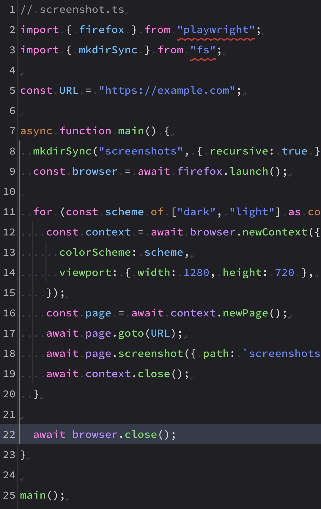
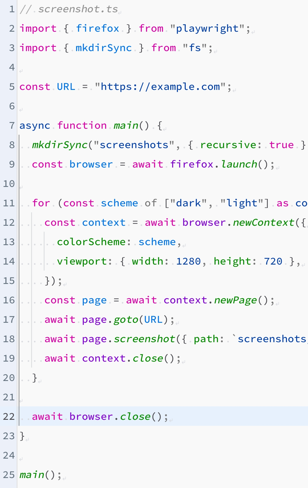

# Firefox Theme for Xed-Editor

A port of **Firefox Theme** (based on the Mozilla Firefox developer tools colors). 🦊

The theme includes a **dark** and a **light** variant in a single file and covers the app interface, the built-in terminal, the editor, and syntax highlighting.

## Screenshots

  <table>
    <tr>
      <td align="center"><b>Dark</b></td>
      <td align="center"><b>Light</b></td>
    </tr>
    <tr>
      <td align="center">
        
      </td>
      <td align="center">
        
      </td>
    </tr>
  </table>

