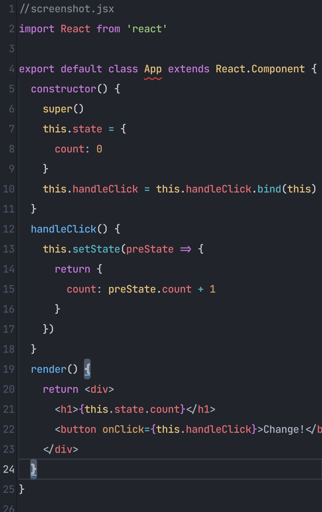

# One Dark Pro for Xed-Editor

A port of the **One Dark Pro** theme, inspired by Atom's classic One Dark. 🌙

The theme covers the app interface, the built-in terminal, the editor, and syntax highlighting.

> **Note:** This theme only includes the **dark** variant. There is no light version.
> 
## Screenshots

<table>
  <tr>
    <td align="center">
      <strong>Dark</strong>
    </td>
  </tr>
  <tr>
    <td align="center">
      
    </td>
  </tr>
</table>
